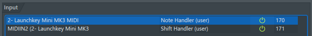

# Key Signature Helper

### (for the Novation Launchkey Mini in FL Studio)

Problem: I don't know piano. But, I don't want to write all of my songs in the key of C.

Solution: Use my _sick Python skills_ to write a script mapping notes in the key of C (the nice easy white notes) to
other key signatures.

This script is built for the Novation Launchkey Mini MK3.

## Features

- `Shift+[note]` changes the key signature to that key (octave doesn't matter)
- Only modifies MIDI note events on MIDI channel `0` (so you can still use drum pads if set up in Novation Components)
- While mapped to another key signature, sharps/flats are ignored (so only the white keys make a sound)

## Installation

See how to set it up
here: https://www.image-line.com/fl-studio-learning/fl-studio-beta-online-manual/html/midi_scripting.htm

TL;DR: Clone the repository into `Documents/Image-Line/FL Studio/Settings/Hardware/`, then select the script under MIDI
settings in FL Studio.

The Launchkey Mini MK3 shows up as two different MIDI devices. One is for the actual notes, and the other is for all the
extraneous events (like the pause/play button).

Here's how mine worked out:

Note that the `Shift Handler` script is selected for the `MIDIIN2` device.